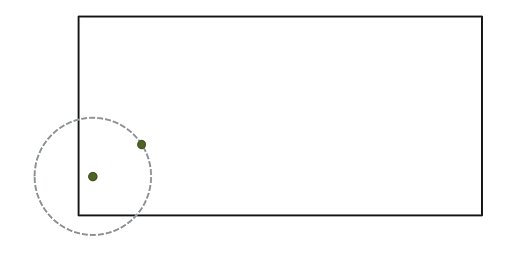

```{r setup, include=FALSE}
knitr::opts_chunk$set(echo = TRUE, message = FALSE,
                      fig.dim = c(8, 5))
library(tidyverse)
library(cowplot)
theme_set(
  theme_cowplot() +
    theme(panel.background = element_rect(fill = "#fafafa"),
          plot.background = element_rect(fill = "#fafafa"))
)

set.seed(8202)
```


# Contents

- Part 1: Point pattern analysis

- Part 2: Geostatistical models

- Part 3: Areal data models

- Part 4: TBD (more examples, tools for more complex models with spatial dependence, e.g., INLA)

---

# Point pattern analysis

- Point data: position of individuals or events in space.

--

- Determine whether points are randomly arranged or clustered; determine whether two types of points are arranged independently or not.

--

- Requires a complete census in a study area.

---

# Geostatistical models

- Point data: sampling points and associated measurements.

--

- Autocorrelation models of measurements as a function of distance between points.  

--

- Spatial smoothing of data and predictions for new points.

---

# Areal data models

- Measurements taken on regions of space. 

--

- Neighbourhood relationships between regions (network or grid).

--

- Models including autocorrelation between neighbouring regions.

---

# Stationarity

- Summary statistics (mean, variance and correlations between measures of a variable) do not vary with translation in space.

--

- Lack of a large-scale trend (gradient).

--

- For point patterns, there is no large-scale trend in the density of points; also called homogeneity.

---

# Isotropy

- Spatial correlations depend only on the distance between measurements, not on the direction. 

--

- Summary statistics do not vary with rotation.

---

# Georeferenced data

- Use of geospatial data sources (e.g. climate, remote sensing) is increasingly common in environmental sciences. 

--

- Processing this data requires concepts related to geographic information systems (GIS); not covered in this course. 

--

- Geospatial data is often used as a predictor to explain a response at different sites. The use of spatial statistics is only necessary when there is spatial correlation of residuals.

---

class: inverse, center, middle

# Point pattern analysis

---

# Point process

- A point pattern describes the spatial position (most often in 2D) of individuals or events, represented by points, in a given study area (spatial window).

--

- Each point is assumed to have negligible spatial extent.

--

- A point process is a statistical model that can be used to simulate point patterns or explain an observed point pattern.

---

# Complete spatial randomness (CSR)

- The simplest null model for a point pattern.

--

- The presence of a point at a given position is independent of the presence of points in a neighbourhood.

--

- Homogeneous Poisson process: the number of points in a region $A$ is given by $N(A) \sim \text{Pois}(\lambda A)$ where $\lambda$ is the *intensity* of the process. $N$ is independent between two disjoint regions.

---

# Example

- Which of the three patterns shows complete spatial randomness?

```{r, include = FALSE}
library(spatstat)
```

```{r, fig.dim = c(12, 5), echo = FALSE}
set.seed(82)
csrp <- rpoispp(lambda = 100)
aggp <- rMatClust(20, 0.1, 5)
evenp <- rMaternII(150, 0.05)
par(mfrow = c(1, 3), bg = "#fafafa")
plot(aggp, main = "", pch = 19)
plot(evenp, main = "", pch = 19)
plot(csrp, main = "", pch = 19)
```

---

# Example

```{r, fig.dim = c(12, 5), echo = FALSE}
par(mfrow = c(1, 3), bg = "#fafafa", cex.main = 2)
plot(aggp, main = "Aggregation", pch = 19)
plot(evenp, main = "Repulsion", pch = 19)
plot(csrp, main = "Random", pch = 19)
```

---

# Summary statistics of point patterns

- Intensity $\lambda$: first-order statistic, density of points in the pattern. For a heterogeneous pattern, $\lambda(x, y)$ depends on position.

--

- Second-order statistics: describe how the presence of points depend on the presence of other points, e.g. Ripley's $K$.

--

- Distribution of these statistics rarely known, even for simple null models. Hypothesis tests proceed by simulating from null model.

---

# Ripley's $K$ function

- $K(r)$ is the mean number of points within a circle of radius $r$ from a point in the pattern, standardized by the intensity $\lambda$.

--

- For the CSR null model, mean number of points is $\lambda \pi r^2$ for any circle of radius $r$, thus in theory $K(r) = \pi r^2$.

--

- Estimating $K(r)$ from a given point pattern:

$$K(r) = \frac{A}{n(n-1)} \sum_i \sum_{j > i} I \left( d_{ij} \le r \right) w_{ij}$$

---

# Example

```{r, include = FALSE}
kagg <- envelope(aggp, Kest, correction = "iso") 
keven <- envelope(evenp, Kest, correction = "iso")
kcsr <- envelope(csrp, Kest, correction = "iso")
```

```{r, fig.dim = c(12, 3), echo = FALSE}
par(mfrow = c(1, 3), bg = "#fafafa", cex.main = 2)
plot(aggp, main = "Aggregation", pch = 19)
plot(evenp, main = "Repulsion", pch = 19)
plot(csrp, main = "Random", pch = 19)
```

```{r, echo = FALSE, fig.dim = c(12, 4)}
par(mfrow = c(1, 3), bg = "#fafafa", cex.main = 2, cex.lab = 1.5, mex = 1.5, mgp = c(2, 1, 0))
plot(kagg, main = "Aggregation", legend = FALSE)
plot(keven, main = "Repulsion", legend = FALSE)
plot(kcsr, main = "Random", legend = FALSE)
```

---

# Edge effects

- Incomplete knowledge of neighbourhood for points near the edge of the observation window.

--

- Ripley's edge correction: contribution of neighbour $j$ at a distance $r$ from point $i$ receives a weight $w_{ij} = 1/\phi_i(r)$.

--

- $\phi_i(r)$ is the fraction of the circle of radius $r$ around $i$ contained in the observation window.



---

# Effect of heterogeneity

- A point density gradient can be confounded with spatial aggregation of points.

```{r, include = FALSE}
lam_gr <- function(x, y) ifelse(x < 0.5, 500*(1-x), 200*(1-x))
hetp <- rpoispp(lam_gr)
khet <- envelope(hetp, Kest, correction = "iso")
```

```{r, echo = FALSE, fig.dim = c(10, 5)}
par(mfrow = c(1, 2), bg = "#fafafa")
plot(hetp, pch = 19, main = "")
plot(khet, main = "", legend = FALSE)
```

---

# Effect of heterogeneity

- For a heterogeneous point pattern, Ripley's $K$ is standardized by local estimate of density $\lambda(x, y)$

--

- The null model is a heterogeneous Poisson process with the same $\lambda(x, y)$ as the original pattern.

--

- Heterogeneity and aggregation can be differentiated if the processes occur at different scales, e.g. large-scale density gradient combined with aggregation of points at a small scale.

---

# Relationship between two point patterns

.pull-left[
- Example: Position of trees of two species in a plot.


- Does the probability of observing a tree of one species depend on the presence of a tree of the other species at a given distance?
]

.pull-right[

```{r, echo = FALSE, fig.dim = c(6, 6)}
data(lansing)
lansing <- subset(lansing, marks %in% c("maple", "redoak"), drop = TRUE)
par(bg = "#fafafa")
plot(lansing, chars = 20, cols = c("#1b9e77", "#d95f02"), main = "", legend = FALSE)
```
]

---

# Bivariate $K$ function

- $K_{12}(r)$: Mean number of points in pattern 2 within a radius $r$ from a point in pattern 1, standardized by the intensity of pattern 2.

--

- $K_{12}(r) = K_{21}(r)$ in theory.

--

- To determine whether there is significant attraction or repulsion between the two patterns, we must randomize their relative position while maintaining each pattern's structure.

---

# Toroidal shift

- Random horizontal and/or vertical translation of one pattern. The part that "comes out" on one side of the window is attached to the other side.

```{r, echo = FALSE, fig.dim = c(10, 5)}
par(mfrow = c(1, 2), bg = "#fafafa")
set.seed(35)
rsh <- rshift(lansing, which = 1, width = 0.5, height = 0)
plot(lansing, chars = 20, cols = c("#1b9e77", "#d95f02"), main = "Original", legend = FALSE)
rect(xleft = 1 - rsh$x[8], xright = 1, ybottom = 0, ytop = 1, 
     col = rgb(0, 0, 0, alpha = 0.1))
plot(rsh, chars = 20, cols = c("#1b9e77", "#d95f02"), main = "After translation", legend = FALSE)
rect(xleft = 0, xright = rsh$x[8], ybottom = 0, ytop = 1, 
     col = rgb(0, 0, 0, alpha = 0.1))
```

---

# Marked point patterns

- Suppose we want to check if the mortality of trees during the outbreak is spatially correlated. How does this question differ from verifying the independent spatial arrangement of two species of trees?

--

- Bivariate point pattern: How does the establisment of one pattern influences the other?

--

- Marked point pattern: With the point positions being fixed, does the mark on a point depend of the mark of neighbouring points?

---

# Mark connection function

- Measures the spatial arrangements of qualitative marks.

--

- $p_{ij}(r)$: For two points separated by a distance $r$, probability that point 1 has mark $i$ and point 2 has mark $j$.

--

- Null hypothesis: marks are independent, so $p_{ij}(r) = p_i p_j$ independently of $r$.

---

class: inverse, center, middle

# Spatial correlation

---

# Spatial correlation of a variable

- Observations near each other in space tend to be more similar than distant ones.

- First law of geography (W. Tobler): "Everything is related to everything else, but near things are more related than distant things."

--

- Autocorrelation: correlation between the measurements of the same variable at different times or places.

---

# Intrinsic or induced dependence

Two types of spatial dependence for an observed response $y$.

--

Induced dependence: due to spatial dependence of external variables that influence $y$.

--

- Abundance of a species is correlated for nearby sites due to similar habitat conditions.

--

If the external variables are included in the model for $y$, the residuals from that model could be independent.

---

# Intrinsic or induced dependence

Intrinsic dependence: due to spatial dependence for the variable $y$ itself.

--

- Abundance of a species is correlated for nearby sites due to dispersal between sites.

--

Intrinsic dependence cannot be eliminated by adding predictors to a model.

---

# Spatial coordinates as predictors

- Example: using longitude and latitude as predictors in a linear or additive model.

--

- Can detect a systematic gradient (linear or not) at a large scale.

--

- Differs from a spatial correlation in the random variation of a variable (i.e. the residuals, after removing all systematic effects).

---

# Comparison with random effects

- Random effects for the non-independence of grouped data: residual variation is correlated between elements of the same group.

--

- Groups are often defined along spatial boundaries (e.g. measurements at several study sites).

--

- Ignores the effect of spatial proximity between groups.

---

class: inverse, center, middle

# Geostatistical models

---

# Geostatistics

- Set of methods that originated in the Earth sciences.

--

- Variables are continuously distributed in space and we want to estimate that distribution from a samples taken at different points.

--

- Consider a variable $z(x, y)$ measured at different $(x, y)$ coordinates. 

--

- Assumption: $z$ is stationary.

---

# Variogram

- The variogram $\gamma_z(h)$ of $z$ is equal to half the mean square difference between the values of $z$ for two points $(x_i, y_i)$ and $(x_j, y_j)$ separated by a distance $h$.

--

$$\gamma_z(h) = \frac{1}{2} \text{E} \left[ \left( z(x_i, y_i) - z(x_j, y_j) \right)^2 \right]_{d_{ij} = h}$$

--

- The variogram is related to the autocorrelation function $\rho_z(h)$ by the equation:

$$\gamma_z = \sigma_z^2(1 - \rho_z)$$

--

- $\gamma$ is sometimes named "semivariogram" or "semivariance" due to the 1/2 factor, but note that in absence of spatial correlation, $\gamma_z = \sigma^2_z$.

---

# Exponential variogram model

$$\rho_z(h) = e^{-h/r}$$

--

- Correlation multiplied by $1/e \approx 0.37$ every time the distance increases by $r$, where $r$ is the *range* of the correlation.

--

$$\gamma_z(h) = \sigma_z^2 (1 - e^{-h/r})$$

---

# Components of a variogram

$$\gamma_z(h) = s (1 - e^{-h/r})$$

```{r, echo = FALSE}
ggplot(NULL) + xlim(0, 10) +
    labs(x = "h", y = expression(gamma)) +
    stat_function(fun = function(x) 5 * (1 - exp(-x/3)),
                  geom = "line", color = "#b3452c", size = 1) +
    geom_hline(yintercept = 5, linetype = "dotted") +
    geom_segment(aes(x = 0, xend = 2.8, y = 5*(1-exp(-1)),
                     yend = 5*(1-exp(-1))), 
                arrow = arrow(length = unit(0.05, "inches"), ends = "both", type = "closed")) +
    annotate("text", x = 1.5, y = 3.5, label = "range", size = 5) +
    annotate("text", x = 9, y = 5.5, label = "sill", size = 5) +
    scale_y_continuous(limits = c(0, 6))
```

---

# Components of a variogram

$$\gamma_z(h) = n + (s - n) (1 - e^{-h/r})$$

```{r, echo = FALSE}
ggplot(NULL) + xlim(0, 10) +
    labs(x = "h", y = expression(gamma)) +
    stat_function(fun = function(x) 4 * (1 - exp(-x/3)) + 1,
                  geom = "line", color = "#b3452c", size = 1) +
    geom_hline(yintercept = 5, linetype = "dotted") +
    geom_segment(aes(x = 0, xend = 2.8, y = 4*(1-exp(-1)) + 1,
                     yend = 4*(1-exp(-1)) + 1), 
                arrow = arrow(length = unit(0.05, "inches"), 
                              ends = "both", type = "closed")) +
    geom_segment(aes(x = 0, xend = 0, y = 0, yend = 0.9),
                 arrow = arrow(length = unit(0.05, "inches"),
                               ends = "both", type = "closed")) +
    annotate("text", x = 1.5, y = 4, label = "range", size = 5) +
    annotate("text", x = 9, y = 5.5, label = "sill", size = 5) +
    annotate("text", x = 1, y = 0.5, label = "nugget", size = 5) +
    scale_y_continuous(limits = c(0, 6))
```

---

# Theoretical variogram models

 Model | $\rho(h)$ | $\gamma(h)$
-------|-----------|-------------
Exponential | $\exp\left(-\frac{h}{r}\right)$ | $s \left(1 - \exp\left(-\frac{h}{r}\right)\right)$
Gaussian | $\exp\left(-\frac{h^2}{r^2}\right)$ | $s \left(1 - \exp\left(-\frac{h^2}{r^2}\right)\right)$
Spherical $(h < r)$ * | $1 - \frac{3}{2}\frac{h}{r} + \frac{1}{2}\frac{h^3}{r^3}$ | $s \left(\frac{3}{2}\frac{h}{r} - \frac{1}{2}\frac{h^3}{r^3} \right)$

\* For a spherical model, $\rho = 0$ and $\gamma = s$ if $h \ge r$.

---

# Theoretical variogram models

```{r, echo = FALSE, fig.dim = c(12, 5)}
vexp <- ggplot(NULL) + xlim(0, 10) +
    labs(x = "h", y = expression(gamma), title = "Exponential") +
    stat_function(fun = function(x) 5 * (1 - exp(-x/3)),
                  geom = "line", color = "#b3452c", size = 1) +
    geom_hline(yintercept = 5, linetype = "dotted")
    

vgau <- ggplot(NULL) + xlim(0, 10) +
    labs(x = "h", y = expression(gamma), title = "Gaussian") +
    stat_function(fun = function(x) 5 * (1 - exp(-x^2/4^2)),
                  geom = "line", color = "#b3452c", size = 1) +
    geom_hline(yintercept = 5, linetype = "dotted")

vsph <- ggplot(NULL) + xlim(0, 10) +
    labs(x = "h", y = expression(gamma), title = "Spherical") +
    stat_function(fun = function(x) ifelse(x < 8, 5 * (1.5*x/8 - 0.5*x^3/8^3), 5),
                  geom = "line", color = "#b3452c", size = 1) +
    geom_hline(yintercept = 5, linetype = "dotted")

plot_grid(vexp, vgau, vsph, nrow = 1)
```

---

# Empirical variogram

- Estimating $\gamma_z(h)$ from the mean square difference for pairs of points separated by a distance of around $h \; (\pm \delta)$. 

$$\hat{\gamma_z}(h) = \frac{1}{2 N_{\text{paires}}} \sum \left[ \left( z(x_i, y_i) - z(x_j, y_j) \right)^2 \right]_{d_{ij} = h \pm \delta}$$

---

# Regression model with spatial correlation

$$v = \beta_0 + \sum_i \beta_i u_i + z + \epsilon$$

- Response $v$ and predictors $u$.

--

- $z$: Spatially correlated residual.

- $\epsilon$: Independent residual.

---

# Regression model with spatial correlation

$$v = \beta_0 + \sum_i \beta_i u_i + z + \epsilon$$

1. Fit the regression model without spatial correlation.

--

2. Verify the presence of spatial correlation from the empirical variogram of the residuals.

--

3. Fit one or more regression models with spatial correlation and select the one that shows the best fit to the data. 

---

# Generalized least squares

- `gls` function in *nlme* package, included with R.

--

- Method to fit linear models when the residuals are not independent or when the residual variance is not the same for all observations.

--

- Uses an iterative algorithm.

---

# Generalized least squares

For the case of a regression with spatial correlation:

--

1. A classical linear regression model (without correlation) is fitted to obtain residuals.

--

2. The spatial correlation model (variogram) is fitted with those residuals.

--

3. The regression coefficients are re-estimated, now taking into account the correlations.

---

# Kriging

- Method for spatial interpolation (prediction for unsampled points in study area) based on a fitted variogram.

--

- Best linear unbiased predictor (BLUP), i.e. having the lowest mean square error among unbiased predictors, if assumptions are met: stationary Gaussian process, variogram function is exact.

--

- Prediction is a weighted mean of the values at sampled points, with weights depending on the estimated correlation between the sampled points and prediction point, but also the correlation between the different sampled points.

--

- In other words, points nearby contribute more, but so do isolated points vs. clusters of points that provide redundant information.

---

# Types of kriging

- Simple kriging: Variable is stationary in space with known mean.

- Ordinary kriging: Variable is stationary in space with unknown mean.

- Universal kriging: Based on variogram of residuals after removing a trend.

---

# Prediction and conditional simulation

- Kriging provides both a mean and a variance for the prediction.

- Conditional simulation: simulate potential values of the variable at unsampled points from Gaussian distribution with predicted mean and variance. 

---

# Other spatial interpolation methods

- Inverse distance weighting

- Spatial smoothing (e.g. with splines)
